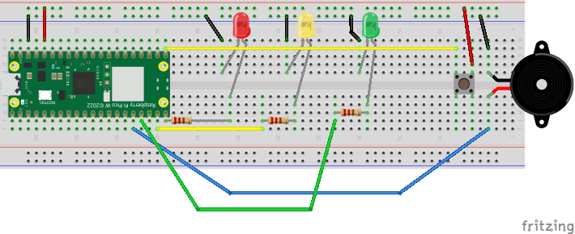

# 按鈕_LED_蜂鳴器
- 同時執行
- 盡量不使用time.sleep()

## 上拉電阻(Pin.PULL_UP)
- ### 按鈕使用上拉電阻,代表GPIO14,內有電阻,並且發出3.3V電壓,另一端接地


## 下拉電阻(Pin.PULL_Down)
- ### 按鈕使用下拉電阻,代表GPIO14,內有電阻,並且接地.另一端接電壓

## 硬體中斷,不受使用者sleep()影響 

### 線路圖


### [影片展示](https://youtu.be/Xjn7ncyV_D4)

### 範例(使用time.sleep())

- 會遇到很多問題
- 沒有使用buzzer,因為無法同步執行
- 使用中斷技巧,連續按按鈕不會出問題

```
from machine import Pin
from machine import Timer
import time


def running(pin):
    btn.irq(None,Pin.IRQ_RISING) #解決按鈕彈跳問題和一直按按鈕,工作會被放在Queue內,最後有空時,就作queue內的工作           
    print("IRQ with flags:", pin.irq().flags())
    timer1 = Timer()    
    timer1.init(period=1000,callback=led_blink,mode=Timer.ONE_SHOT)
    
def task(n, delay):
    led = machine.Pin("LED", machine.Pin.OUT)
    for i in range(n):
        led.high()
        time.sleep(delay)
        led.low()
        time.sleep(delay)
    print('done')


def led_blink(timer:Timer):
    for i in range(redI):
       redLed.value(1)
       time.sleep_ms(200)
       redLed.value(0)
       time.sleep_ms(200)
    
    for i in range(yellowI):
        yellowLed.value(1)
        time.sleep_ms(200)
        yellowLed.value(0)
        time.sleep_ms(200)
        
    greenLed.value(1)
    time.sleep(3)
    greenLed.value(0)
    buzzerStatus = False
    btn.irq(running, Pin.IRQ_RISING) #解決按鈕彈跳問題
        

if __name__ == '__main__':
    btn = Pin(16,Pin.IN,Pin.PULL_DOWN) #打開上拉電阻
    redLed = Pin(15,Pin.OUT) #紅燈
    yellowLed = Pin(14,Pin.OUT) #黃燈
    greenLed = Pin(13,Pin.OUT) #綠燈
    buzzer = Pin(12,Pin.OUT) #蜂鳴器
    btn.irq(running, Pin.IRQ_RISING) #啟動IRQ,IRQ一執行會停止主thread的工作和次執行序(所有的工作),直到執行完才會釋放main thread,和次執行序
    redI:int = 5 #計紅燈閃的次數
    yellowI:int = 5 #計黃燈閃的次數
    '''irq一執行時,主程式會停止,等irq工作完後才會繼續,可以由以下程式驗證    
    while True:
        print("執行")
        time.sleep(1)
    '''    

```

### 範例(使用Timer)
- 有使用buzzer
- 使用中斷技巧,連續按按鈕不會出問題
- [影片展示](https://youtu.be/Xjn7ncyV_D4)

```
from machine import Pin
from machine import Timer


timer4 = Timer()
def running(pin):
    btn.irq(None,Pin.IRQ_RISING) #解決按鈕彈跳問題和一直按按鈕,工作會被放在Queue內,最後有空時,就作queue內的工作           
    print("IRQ with flags:", pin.irq().flags())
    timer1 = Timer()    
    timer1.init(period=200,callback=red_blink,mode=Timer.PERIODIC)
    timer4.init(period=200,callback=buzzer_bu,mode=Timer.PERIODIC)
    


redStatus = False
redI:int = 10 #計紅燈閃的次數
def red_blink(timer:Timer):
    global redStatus
    global redI
    if redI != 0:
        redI -= 1
        if redStatus == False:
            redLed.value(1)
            redStatus = True
        else:
            redLed.value(0)
            redStatus = False
    else:
        redI = 10
        redLed.value(0)
        timer.deinit()
        timer2 = Timer()
        timer2.init(period=200,callback=yellow_blink,mode=Timer.PERIODIC)
        
        
yellowStatus = False
yellowI:int = 10 #計紅燈閃的次數
def yellow_blink(timer:Timer):
    global yellowStatus
    global yellowI
    if yellowI != 0:
        yellowI -= 1
        if yellowStatus == False:
            yellowLed.value(1)
            yellowStatus = True
        else:
            yellowLed.value(0)
            yellowStatus = False
    else:
        yellowI = 10
        yellowLed.value(0)        
        timer.deinit()
        greenLed.value(1)#亮綠燈
        timer3 = Timer()
        timer3.init(period=3000,callback=dark_green,mode=Timer.ONE_SHOT)
        
def dark_green(timer:Timer):
    greenLed.value(0)
    timer4.deinit()
    buzzer.value(0)
    buzzerStatus = False
    btn.irq(running, Pin.IRQ_RISING) #解決按鈕彈跳問題
    
buzzerStatus = False
def buzzer_bu(timer:Timer):
    global buzzerStatus
    if buzzerStatus == False:
        buzzer.value(1)
        buzzerStatus = True
    else:
        buzzer.value(0)
        buzzerStatus = False
    
    
        
    
btn = Pin(16,Pin.IN,Pin.PULL_DOWN) #打開上拉電阻
redLed = Pin(15,Pin.OUT) #紅燈
yellowLed = Pin(14,Pin.OUT) #黃燈
greenLed = Pin(13,Pin.OUT) #綠燈
buzzer = Pin(12,Pin.OUT) #蜂鳴器        
btn.irq(running, Pin.IRQ_RISING) #啟動IRQ,IRQ一執行會停止主thread的工作和次執行序(所有的工作),直到執行完才會釋放main thread,和次執行序


```


